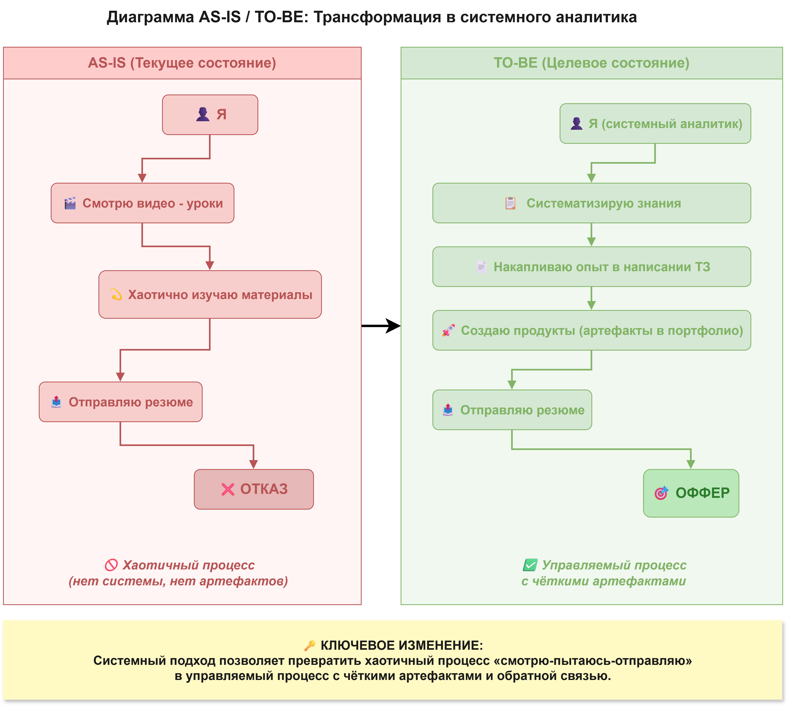

# План развития компетенций системного аналитика
## System Analyst Competence Development Plan

---

## Содержание

- [Концепция документа](#концепция-документа)
- [Введение](#введение)
- [Глоссарий](#глоссарий)
- [Цель и задачи](#цель-и-задачи)
- [Диаграмма AS-IS / TO-BE](#диаграмма-as-is--to-be)
- [Стейкхолдеры](#стейкхолдеры)
- [Функциональные требования к навыкам](#функциональные-требования-к-навыкам)
- [Нефункциональные требования](#нефункциональные-требования)
- [План обучения](#план-обучения)
- [Архитектура Пет-проекта «Скоринг-система»](#архитектура-пет-проекта-скоринг-система)
- [Критерии приёмки](#критерии-приёмки)
- [Приложения](#приложения)

---

## Концепция документа

Данный документ представляет собой структурированный план по трансформации из начинающего специалиста в системного аналитика. В качестве метафоры используется структура технического задания, где вместо требований к ПО описываются требования к собственным знаниям, а вместо этапов разработки — этапы обучения и интеграции знаний в существующие проекты.

Документ является **публичным артефактом** и размещён на GitHub для демонстрации подхода к самоорганизации, системному мышлению и умению управлять собственным портфолио.

---

## Введение

Я — специалист без коммерческого опыта в системном анализе, но с системным мышлением и техническим бэкграундом. Ключевая задача — не просто изучить теорию, а подтвердить свои навыки через практические артефакты в портфолио.

Данный план служит картой, связывающей **теоретическое обучение** (20 видео-уроков) с **реальными пет-проектами**. Вместо того чтобы создавать артефакты «в вакууме», я интегрирую новые компетенции в свои существующие и новые проекты, демонстрируя целостный подход к разработке. Центральным проектом становится разработка технической документации для **системы скоринга и автоматического одобрения кредитных заявок**.

---

## Глоссарий

| Термин | Определение |
|--------|-------------|
| **Системный аналитик** | Проектировщик цифровых решений, который через активное взаимодействие со стейкхолдерами выявляет потребности бизнеса, документирует их в виде комплексного технического задания и сопровождает этот документ до релиза. |
| **Техническое задание (ТЗ)** | Основной артефакт работы аналитика — структурированный документ, содержащий бизнес-контекст, требования, модели данных, спецификации API и другие сведения, необходимые для реализации продукта. |
| **MVP навыков** | Минимальный набор компетенций, достаточный для успешного выполнения задач начинающего системного аналитика: владение нотациями (BPMN, UML), базовое знание SQL, понимание REST API и принципов работы с Git. |
| **Артефакт** | Материальный результат работы аналитика: документ, диаграмма, спецификация, схема данных, макет интерфейса и т.п. |
| **Пет-проект** | Проект, выполняемый в личное время для развития навыков и пополнения портфолио. В контексте данного документа — **«Скоринг-система»** (автоматическое одобрение заявок на кредит), которая служит основой для создания комплексного ТЗ. |
| **Библиотека знаний** | Систематизированный конспект по итогам изучения 20 уроков, структурированный для быстрого поиска информации и повторения. |
| **Скоринг** | Статистическая модель оценки кредитоспособности заёмщика на основе его персональных данных, финансовой истории и поведенческих факторов. |

---

## Цель и задачи

**Цель:** Сформировать портфолио, демонстрирующее ключевые компетенции системного аналитика, и получить **не менее 3 приглашений на собеседование** в течение 3 месяцев после публикации резюме.

**Задачи и критерии их выполнения:**

| № | Задача (Компетенция) | Измеримый результат (артефакт) | Связь с существующим/новым проектом |
|---|-----------------------|--------------------------------|--------------------------------------|
| 1 | Моделирование бизнес-процессов (BPMN) | Наличие **1 диаграммы BPMN** для ключевого процесса в любом проекте | **Уже есть** в пет-проектах «Командировки» и «Менторинг» |
| 2 | Описание вариантов использования (UML Use Case) | Наличие **1 диаграммы Use Case** с минимум 3 актёрами и 5 вариантами использования | **Уже есть** в пет-проекте «Менторинг» |
| 3 | Документирование сценариев (UML Sequence) | Наличие **1 диаграммы последовательности** для ключевого сценария | **Будет создана** для пет-проекта «Скоринг-система» |
| 4 | Проектирование БД и SQL | Наличие **ER-диаграммы** (логический уровень) с минимум 6 сущностями. Наличие **3 SQL-запросов** разной сложности | **ER-диаграмма уже есть** в пет-проекте «Менторинг». **SQL-запросы будут написаны** для «Скоринг-системы» |
| 5 | Проектирование REST API | Наличие **API-спецификации** (OpenAPI/Markdown) с минимум **5 эндпоинтами** | **Уже есть** пет-проекте «Менторинг»|
| 6 | Асинхронное взаимодействие (очереди) | Наличие **текстового раздела** в ТЗ с обоснованием использования очереди (RabbitMQ/Kafka) | **Будет добавлен** в ТЗ для пет-проекта «Скоринг-система» |
| 7 | Комплексное документирование | Наличие **документа «Техническая спецификация»** для пет-проекта, содержащего все ключевые разделы | **Будет создан** для пет-проекта «Скоринг-система» |
| 8 | Презентация портфолио | Размещено **резюме** на hh.ru. **GitHub-репозиторий** оформлен и содержит README с навигацией по всем проектам | Репозиторий обновлён, ссылка добавлена в резюме |
| 9 | Систематизация знаний | Оформлена **«Библиотека системного аналитика»** — 20 конспектов с выделением ключевых понятий и связью с проектами | Подпапка `knowledge-base/` в папке analyst_roadmap |

---

## Диаграмма AS-IS / TO-BE

Ниже представлена контекстная диаграмма, показывающая разрыв между текущим и целевым состоянием.

---

## Стейкхолдеры

| Стейкхолдер | Роль в проекте | Ключевой интерес | Критерий успеха |
|-------------|----------------|-------------------|-----------------|
| **Я (Исполнитель)** | Разрабатываю план, учусь, создаю артефакты | Получить работу и профессионально реализоваться | Документ выполнен, артефакты созданы, есть оффер |
| **Рекрутер / HR** | Первичный фильтр | Найти специалиста, который подойдёт команде | Резюме содержит понятный стек, портфолио демонстрирует системный подход |
| **Будущий Team Lead** | Вторичный фильтр | Оценить способность кандидата самостоятельно вести задачи, понимать архитектуру | Кандидат отвечает на вопросы по нотациям, SQL, API; может аргументировать проектные решения |

---

## Функциональные требования к навыкам

| Категория | Навык | Уровень к концу проекта | Подтверждение в портфолио |
|-----------|-------|--------------------------|---------------------------|
| **Бизнес-анализ** | Выявление требований, интервью, воркшопы | Базовый (теория + 1 практика) | Описано в разделе «Сбор требований» для «Скоринг-системы» |
| **Документирование** | Составление Vision и Технической спецификации (ТЗ) | Продвинутый | Полноценный документ для «Скоринг-системы» |
| **Нотации** | BPMN, UML (Use Case, Sequence) | Практический | Диаграммы в существующих проектах и в ТЗ «Скоринг-системы» |
| **Базы данных** | ER-диаграммы, SQL (SELECT, JOIN, GROUP BY) | Базовый-практический | Модель и запросы в проектах |
| **API** | Проектирование REST API | Практический | Спецификация для «Скоринг-системы» |
| **Архитектура** | Монолитная и микросервисная архитектуры | Теоретический | Описано в ТЗ «Скоринг-системы» |
| **Интеграции** | Синхронное и асинхронное взаимодействие | Базовый | Раздел в ТЗ «Скоринг-системы» (взаимодействие с внешними кредитными бюро) |
| **Безопасность** | Аутентификация, JWT, OAuth 2.0 | Базовый | Описано в разделе безопасности для «Скоринг-системы» |
| **Инструменты** | Git, Markdown, Draw.io, Postman/Swagger | Практический | Все используются в проектах |

---

## Нефункциональные требования

| Категория | Требование | Обоснование |
|-----------|------------|-------------|
| **Временные** | Общая продолжительность — **3 месяца** (12 недель) | Реалистичный срок для совмещения с основной деятельностью |
| **Бюджетные** | 0 ₽ | Используются только бесплатные инструменты и ресурсы |
| **Ресурсные** | Доступны: компьютер, интернет, бесплатные версии ПО | Нет необходимости покупать лицензии |
| **Качественные (к документу)** | Все артефакты должны быть понятны техническому специалисту с опытом от 2 лет | Документы не должны требовать дополнительных устных пояснений |
| **Качественные (к обучению)** | Каждый изученный урок должен иметь практическое отражение в портфолио | Исключается «пассивное» обучение — вся теория проверяется на практике |
| **Приёмочные** | GitHub-репозиторий должен быть открытым и содержать README с навигацией по всем проектам | Портфолио должно быть доступно для просмотра без запроса доступа |

---

## План обучения

Обучение разбито на **4 спринта по 3 недели** каждый. Параллельно с изучением уроков ведётся работа над пет-проектом **«Скоринг-система»** и интеграцией знаний в существующие проекты.

### Спринт 1. Введение и бизнес-анализ (Недели 1–3)

| № | Урок | Основная тема | Практическое применение |
|---|------|---------------|--------------------------|
| 1 | Введение в профессию системного аналитика | Роли в IT, этапы разработки | Заполнен раздел «Введение» и «Глоссарий» в плане |
| 2 | Жизненный цикл и команда разработки ПО | ЖЦ ПО, роли в команде | Определение места аналитика в команде для «Скоринг-системы» |
| 3 | Разработка требований | Уровни требований, методы сбора | Написана концепция (Vision) для «Скоринг-системы» |

**Итог спринта:** Определена концепция скорингового проекта, собран бэклог требований (включая интеграции с БКИ - Бюро кредитных историй).

---

### Спринт 2. Требования и бизнес-процессы (Недели 4–6)

| № | Урок | Основная тема | Практическое применение |
|---|------|---------------|--------------------------|
| 4 | Моделирование бизнес-процессов | BPMN, алгоритм описания процессов | Актуализирована BPMN-диаграмма в существующем проекте |
| 5 | Пользовательские и функциональные требования | Use Case Diagram, сценарии | Созданы Use Case и сценарии для «Скоринг-системы» (процесс рассмотрения заявки) |
| 6 | Нефункциональные требования | Качество, безопасность, масштабируемость | Описаны NFR для «Скоринг-системы» (время ответа, отказоустойчивость) |
| 7 | Требования к UI. Прототипирование | Принципы проектирования UI | Создан прототип экранов для «Скоринг-системы» (анкета заёмщика, дашборд) |

**Итог спринта:** Готовы разделы требований и процессов для ТЗ «Скоринг-системы».

---

### Спринт 3. Данные и архитектура (Недели 7–9)

| № | Урок | Основная тема | Практическое применение |
|---|------|---------------|--------------------------|
| 8 | Базы данных | Реляционные и NoSQL БД | Выбор СУБД для «Скоринг-системы» |
| 9 | Модель данных | Сущности, атрибуты, связи | Создана ER-диаграмма для «Скоринг-системы» |
| 10 | Базовый синтаксис SQL | SELECT, JOIN, агрегация | Написаны SQL-запросы для существующих проектов и «Скоринг-системы» |
| 11 | Введение в архитектуру системы | Трёхслойная архитектура | Описана архитектура для «Скоринг-системы» |
| 12 | Протокол HTTP, JSON, XML | Структура запросов, форматы данных | Актуализированы спецификации API в проектах |

**Итог спринта:** Готова модель данных (включая логирование скоринговых решений) и архитектурный блок ТЗ.

---

### Спринт 4. API, интеграции и завершение проекта (Недели 10–12)

| № | Урок | Основная тема | Практическое применение |
|---|------|---------------|--------------------------|
| 13 | Архитектура монолитов и микросервисов | Сравнение, выбор архитектуры | Обоснование выбора в ТЗ «Скоринг-системы» |
| 14 | Диаграммы последовательности | UML Sequence, C4-модель | Создана Sequence-диаграмма для сценария «Автоматическое одобрение заявки» |
| 15 | Виды интеграций и проектирование API | REST API, HTTP-методы, JSON | Создана спецификация API для «Скоринг-системы» (эндпоинты подачи заявки и проверки статуса) |
| 16 | Интеграции с помощью очередей сообщений | Синхронное vs асинхронное, RabbitMQ, Kafka | В ТЗ добавлен раздел «Интеграции» (асинхронный запрос в БКИ - Бюро кредитных историй) |
| 17 | Авторизация | Идентификация, JWT, OAuth 2.0 | Добавлен раздел «Безопасность» в спецификацию (разграничение ролей оператора и системы) |
| 18 | Postman, Swagger, инструменты браузера | Тестирование API, документирование | Демонстрация API через Postman/Swagger |
| 19 | Передача задач в разработку и тестирование | Декомпозиция, тест-кейсы | Написана декомпозиция задач для «Скоринг-системы» (Эпики: Анкетирование, Расчёт скора, Интеграция) |
| 20 | Собеседование на позицию системного аналитика | Разбор кейсов, теория | Составлен чек-лист для самоподготовки + обновлено резюме |

**Итог спринта:** Полностью готово ТЗ для «Скоринг-системы», резюме размещено, чек-лист составлен.

---

## Архитектура Пет-проекта «Скоринг-система»

*Этот раздел определяет структуру будущего ТЗ для системы автоматического одобрения кредитных заявок.*

**Концепция проекта:** Разработка технической документации для высоконагруженной системы, которая автоматически оценивает кредитоспособность заёмщиков на основе анкетных данных и внешних источников, принимает решение об одобрении/отказе и выдаёт предварительные условия кредита.

**Целевая архитектура ТЗ (9 разделов):**

| № раздела | Название раздела | Что входит | Связь с уроками |
|-----------|------------------|------------|-----------------|
| **2.1** | **Перечень бизнес-процессов** | Список ключевых процессов: «Подача заявки», «Скоринг-расчёт», «Интеграция с БКИ», «Выдача решения» | Уроки 3–4 |
| **2.2** | **Основной бизнес-процесс в нотации BPMN** | Диаграмма процесса «Обработка кредитной заявки» (с параллельным запросом в БКИ) | Урок 4 |
| **2.3** | **Диаграмма вариантов использования (Use Case)** | Диаграмма с актёрами: Заёмщик, Кредитный специалист, Администратор, Внешнее БКИ | Урок 5 |
| **2.4** | **Сценарии вариантов использования** | Текстовое описание для сценариев: «Подача заявки» (основной поток) и «Отказ в выдаче» (альтернативный) | Урок 5 |
| **2.5** | **Функциональные и нефункциональные требования** | F-требования (расчёт скора, валидация, автоматическое решение) и NFR (время обработки < 5 сек, 99.9% доступность) | Уроки 5–6 |
| **2.6** | **Модель данных (ER-диаграмма)** | Логическая модель: Клиент, Заявка, Кредитный продукт, Скор-решение, История статусов, Результат проверки БКИ | Уроки 8–9 |
| **2.7** | **Диаграммы последовательности (Sequence)** | Диаграмма для сценария «Расчёт скора с асинхронным вызовом БКИ» | Урок 14 |
| **2.8** | **Описание методов API** | Спецификация REST API: подача заявки, проверка статуса, получение решения, вебхуки для БКИ | Уроки 12, 15 |
| **2.9** | **Декомпозиция задач для разработки** | Разбивка на эпики: UI/API, Ядро скоринга, Интеграции, Администрирование | Урок 19 |

---

## Критерии приёмки

Проект считается выполненным успешно при соблюдении **всех** следующих условий:

| № | Критерий | Статус | Дата выполнения |
|---|----------|--------|-----------------|
| 1 | Просмотрено и законспектировано **все 20 уроков** (папка `knowledge-base/`) | ✅ | — |
| 2 | Сформулирована концепция **(Vision)** для пет-проекта «Скоринг-система» | ⬜ | — |
| 3 | Написана **Техническая спецификация** для «Скоринг-системы» (все 9 разделов) | ⬜ | — |
| 4 | Созданы **диаграммы** для проекта или подтверждено их наличие в других проектах: BPMN (1), Use Case (1), Sequence (1), ER (1) | ⬜ | — |
| 5 | Создана **API-спецификация** (5 эндпоинтов) для «Скоринг-системы» | ⬜ | — |
| 6 | Написано **3 SQL-запроса** разной сложности (в любом проекте) | ⬜ | — |
| 7 | **GitHub-репозиторий** открыт и содержит README с навигацией по плану, проектам и конспектам | ✅ | — |
| 8 | **Резюме** опубликовано на hh.ru (или платформе) с ссылкой на репозиторий | ✅ | — |
| 9 | Получено **не менее 3 приглашений на собеседование** по новому резюме | ⬜ | — |

---

## Приложения

| Приложение | Описание | Ссылка/статус |
|------------|----------|---------------|
| **A. Библиотека системного аналитика** | Конспекты всех 20 уроков (папка `knowledge-base/`) | **[`/knowledge_base/`](./knowledge_base/)** |
| **B. Техническая спецификация (ТЗ)** | Полный документ для пет-проекта «Скоринг-система» | **[Скоринг-система](../scoring_system/README.md)** |
| **C. Резюме** | Профессиональное резюме с указанием стека и ссылкой на портфолио | **[Резюме на hh.ru](https://hh.ru/resume/0548fd01ff1080a5e90039ed1f637672497778)** |
| **D. Чек-лист для собеседования** | Список вопросов по теории и практике с ответами (по уроку 20) | **[Вопросы к собесу](./knowledge_base/les-20-interview.md)** |

---

*Дата последнего обновления: 02.09.2026*
