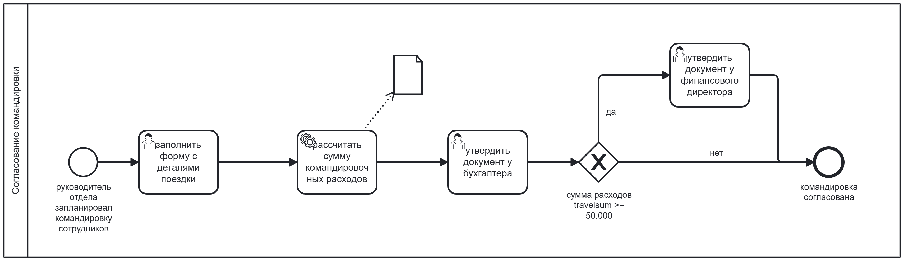
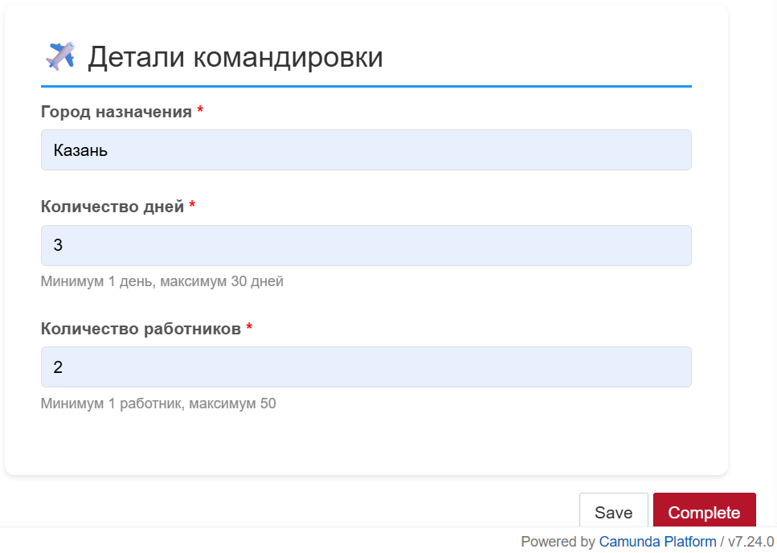

# Система согласования командировок

> BPMN-процесс согласования командировок с динамическими ставками из базы данных и генерацией документов для печати.

---

## 📑 Оглавление

- [Описание проекта](#-описание-проекта)
- [Цели проекта](#-цели-проекта)
- [BPMN-схема процесса](#bpmn-схема-процесса)
- [Пользовательская форма](#пользовательская-форма)
- [Технологический стек](#технологический-стек)
- [Структура проекта](#-структура-проекта)
- [Логика маршрутизации](#-логика-маршрутизации)
- [База данных ставок](#база-данных-ставок-city_rates)
- [Примеры сгенерированных документов](#-примеры-сгенерированных-документов)
- [Инструкция по запуску](#-инструкция-по-запуску)
- [Тестовые сценарии](#-тестовые-сценарии)
- [Логирование процесса](#логирование-процесса)
- [Ключевые особенности реализации](#-ключевые-особенности-реализации)
- [Результаты проекта](#результаты-проекта)
- [Полезные ресурсы](#-полезные-ресурсы)


---

## 📋 Описание проекта

Проект представляет собой **BPMN-процесс**, разработанный на платформе **Camunda**, для автоматизации процесса согласования служебных командировок.

### Возможности системы:

| № | Функциональность | Описание |
|---|------------------|----------|
| 1 | **Заполнение формы** | Ввод данных о командировке: город, количество дней, число работников |
| 2 | **Получение ставки из БД** | Автоматический запрос ставки суточных из базы данных в зависимости от города |
| 3 | **Расчет суммы** | Автоматический расчет общей суммы командировочных расходов |
| 4 | **Генерация документа** | Создание служебной записки в формате TXT для печати |
| 5 | **Маршрутизация** | Направление документа на согласование бухгалтеру или фин.директору в зависимости от суммы |

---

## 🎯 Цели проекта

| № | Цель | Описание |
|---|------|----------|
| 1 | **Автоматизация** | Автоматизация процесса согласования командировок |
| 2 | **Интеграция** | Интеграция с базой данных для динамического расчета ставок |
| 3 | **Генерация** | Генерация документов для печати |
| 4 | **Прозрачность** | Обеспечение прозрачности процесса через логирование каждого шага |
| 5 | **Гибкость** | Гибкая маршрутизация в зависимости от суммы расходов |

## 📋 Описание проекта

Проект представляет собой **BPMN-процесс**, разработанный на платформе **Camunda**, для автоматизации процесса согласования служебных командировок. Система позволяет:

- 🔹 Заполнять форму с деталями командировки (город, дни, количество работников)
- 🔹 Автоматически получать ставку суточных из базы данных в зависимости от города
- 🔹 Рассчитывать общую сумму командировочных расходов
- 🔹 Генерировать служебную записку для печати (в формате TXT)
- 🔹 Маршрутизировать документ на согласование (бухгалтер / фин.директор) в зависимости от суммы

---

## BPMN-схема процесса



---

## Пользовательская форма



---

## Технологический стек

| Компонент | Технология | Назначение |
|-----------|------------|------------|
| **BPMN-движок** | Camunda Platform 7.24.0 | Запуск и управление процессом |
| **Язык сценариев** | Groovy | Логика внутри BPMN-элементов |
| **База данных** | H2 (embedded) | Хранение ставок по городам |
| **Пользовательские формы** | HTML + CSS | Ввод данных пользователем |
| **Генерация документов** | Groovy + Java I/O | Создание TXT-файлов для печати |
| **IDE** | Camunda Modeler 5.49.0 | Разработка BPMN-диаграмм |

---

## 📁 Структура проекта


| Файл/Папка | Описание |
|------------|----------|
| `business_trip.bpmn` | BPMN-диаграмма процесса |
| `business_trip.png` | Скриншот диаграммы |
| `travel-form.html` | HTML-форма для ввода данных |
| `travel-form.png` | Скриншот формы |
| `db-setup.sql` | Скрипт инициализации бд |
| `documents/` | Папка для сгенерированных документов |
| `README.md` | Документация проекта |

**Содержимое папки `documents/`:**

| Файл | Описание |
|------|----------|
| `travel_document_2026-08-05_18-13-20_Сочи.txt` | Документ для командировки в Сочи |
| `travel_document_2026-08-05_18-14-59_Москва.txt` | Документ для командировки в Москву |

---

## 📊 Логика маршрутизации

| Сумма расходов | Согласование | Результат |
|----------------|--------------|-----------|
| `< 50 000 RUB` | Только бухгалтер | ✅ Командировка согласована |
| `>= 50 000 RUB` | Бухгалтер + Финансовый директор | ✅ Командировка согласована (с доп. согласованием) |

---

## База данных ставок (city_rates)

Для работы проекта используется встроенная база данных **H2** с таблицей `city_rates`.

| Город | Ставка (руб./день/чел.) |
|-------|------------------------|
| Москва | 5 500 |
| Санкт-Петербург | 5 000 |
| Казань | 4 500 |
| Новосибирск | 4 200 |
| Екатеринбург | 4 000 |
| Сочи | 4 500 |
| Владивосток | 4 800 |
| Ростов-на-Дону | 3 700 |
| ... и еще 10 городов | ... |

> **Примечание:** SQL-скрипт для создания таблицы и заполнения начальными данными находится в файле `db-setup.sql`. При первом запуске процесса таблица создается автоматически.


---

## 📄 Примеры сгенерированных документов

1. Сумма < 50.000
```
========================================================
              СЛУЖЕБНАЯ ЗАПИСКА
              о служебной командировке
========================================================

Город назначения:          Москва
Количество дней:           3
Количество работников:     1
Ставка (руб./день/чел.):   5500

--------------------------------------------------------
ИТОГО:                     16 500 RUB
--------------------------------------------------------

Статус согласования:
  ✅ Требуется утверждение бухгалтера

========================================================
СОГЛАСОВАНО:

Бухгалтер:                   ___________________
                             (Иванова М.А.)

========================================================
Дата создания документа: 2026-08-05 18:37:26
========================================================
```

2. Сумма >= 50.000

```
========================================================
              СЛУЖЕБНАЯ ЗАПИСКА
              о служебной командировке
========================================================

Город назначения:          Сочи
Количество дней:           30
Количество работников:     40
Ставка (руб./день/чел.):   4500

--------------------------------------------------------
ИТОГО:                     5 400 000 RUB
--------------------------------------------------------

Статус согласования:
  ✅ Требуется утверждение бухгалтера
  ✅ Требуется утверждение финансового директора

========================================================
СОГЛАСОВАНО:

Бухгалтер:                   ___________________
                             (Иванова М.А.)


Финансовый директор:          ___________________
                             (Сидоров В.П.)

========================================================
Дата создания документа: 2026-08-05 18:36:41
========================================================
```

---

## 🚀 Инструкция по запуску

1. Установите Camunda Run


```bash
# Скачайте Camunda Run с официального сайта
# Распакуйте архив в папку D:/Distrib/camunda-run/
```

2. Настройте кодировку UTF-8

```bash
Создайте файл start-utf8.bat в папке Camunda Run:

@echo off
chcp 65001 > nul
set JAVA_OPTS=-Dfile.encoding=UTF-8 -Dconsole.encoding=UTF-8 -Dsun.jnu.encoding=UTF-8
set JAVA_TOOL_OPTIONS=-Dfile.encoding=UTF-8

echo ========================================
echo   Starting Camunda Run with UTF-8
echo ========================================
echo.

SET BASEDIR=%~dp0
SET EXECUTABLE=%BASEDIR%internal\run.bat

IF [%~1]==[] GOTO StartInCurrentWindow

SET CMD_LINE_ARGS=
:setArgs
IF [%~1]==[] GOTO StartWithArguments
SET CMD_LINE_ARGS=%CMD_LINE_ARGS% %1
SHIFT
GOTO setArgs

:StartInCurrentWindow
call "%EXECUTABLE%" start
timeout /t 10 /nobreak > NUL
start http://localhost:8080/camunda-welcome/index.html
GOTO Done

:StartWithArguments
call "%EXECUTABLE%" start %CMD_LINE_ARGS%

:Done
```


3. Запустите Camunda Run

```bash
# Из PowerShell:
.\start-utf8.bat

# Или из командной строки:
start-utf8.bat
```

4. Разверните процесс

```bash
Откройте business_trip.bpmn в Camunda Modeler
Нажмите "Deploy"

В окне деплоя прикрепите travel-form.html как дополнительный файл
Нажмите "Deploy"
```

5. Запустите процесс

```bash
Откройте браузер: http://localhost:8080/camunda/app/tasklist

Найдите задачу "заполнить форму с деталями поездки"

Заполните форму и отправьте

Следите за выполнением процесса в логах

```

## 🧪 Тестовые сценарии

| Сценарий | Город | Дни | Работники | Расчет | Согласование |
|----------|-------|-----|-----------|--------|--------------|
| **Сумма < 50 000** | Москва | 2 | 1 | 2 × 1 × 5 500 = **11 000 RUB** | Только бухгалтер |
| **Сумма >= 50 000** | Сочи | 30 | 2 | 30 × 2 × 4 500 = **270 000 RUB** | Бухгалтер + Финансовый директор |
| **Город не найден в БД** | Нью-Йорк | 4 | 2 | 4 × 2 × 5 000 = **40 000 RUB** (ставка по умолчанию) | Только бухгалтер |


## Логирование процесса

1. Сценарий (**Сумма < 50 000**)
```
======================================
Process started: Business trip approval
sStart time: 2026-08-05 22:53:10
Process instance ID: 478e426c-9107-11f1-afba-fc702e1d1ad4
------------------------------
┌─────────────────────────────────────────
│ FORM DATA RECEIVED
├─────────────────────────────────────────
│ Город:             Москва
│ Количество дней:   2
│ Число работников:  1
└─────────────────────────────────────────
user task completed: fill travel form
┌─────────────────────────────────────────
│ GETTING DAILY RATE FROM DATABASE
├─────────────────────────────────────────
│ Город:           Москва
│ Ставка:          5500 руб./день/чел.
└─────────────────────────────────────────
service task completed: get daily rate from DB
┌─────────────────────────────────────────
│ CALCULATING TRAVEL EXPENSES
├─────────────────────────────────────────
│ Город:           Москва
│ Количество дней: 2
│ Число работников:1
│ Ставка:          5500 руб./день/чел.
├─────────────────────────────────────────
│ ИТОГО:           11000 RUB
│ (свыше 50 000 руб. - требуется фин.директор)
└─────────────────────────────────────────
service task completed: calculate the amount of travel expenses
┌─────────────────────────────────────────
│ GENERATING TRAVEL DOCUMENT
├─────────────────────────────────────────
│ [OK] Документ создан: D:/Projects/specs/business_trip/documents/travel_document_2026-08-05_22-53-46_Москва.txt
│ Сумма: 11 000 RUB
└─────────────────────────────────────────
service task completed: generate PDF document
user task completed: approve the document from the accountant
------------------------------
Process completed: Business trip approval
End time: 2026-08-05 22:53:49
Process instance ID: 478e426c-9107-11f1-afba-fc702e1d1ad4
======================================
```

2. Сценарий (**Сумма >=  50 000**)
```
======================================
Process started: Business trip approval
sStart time: 2026-08-05 22:56:23
Process instance ID: bc6a0815-9107-11f1-afba-fc702e1d1ad4
------------------------------
┌─────────────────────────────────────────
│ FORM DATA RECEIVED
├─────────────────────────────────────────
│ Город:             Сочи
│ Количество дней:   30
│ Число работников:  2
└─────────────────────────────────────────
user task completed: fill travel form
┌─────────────────────────────────────────
│ GETTING DAILY RATE FROM DATABASE
├─────────────────────────────────────────
│ Город:           Сочи
│ Ставка:          4500 руб./день/чел.
└─────────────────────────────────────────
service task completed: get daily rate from DB
┌─────────────────────────────────────────
│ CALCULATING TRAVEL EXPENSES
├─────────────────────────────────────────
│ Город:           Сочи
│ Количество дней: 30
│ Число работников:2
│ Ставка:          4500 руб./день/чел.
├─────────────────────────────────────────
│ ИТОГО:           270000 RUB
│ (свыше 50 000 руб. - требуется фин.директор)
└─────────────────────────────────────────
service task completed: calculate the amount of travel expenses
┌─────────────────────────────────────────
│ GENERATING TRAVEL DOCUMENT
├─────────────────────────────────────────
│ [OK] Документ создан: D:/Projects/specs/business_trip/documents/travel_document_2026-08-05_22-56-42_Сочи.txt
│ Сумма: 270 000 RUB
└─────────────────────────────────────────
service task completed: generate PDF document
user task completed: approve the document from the accountant
user task completed: approve the document from the finance director
------------------------------
Process completed: Business trip approval
End time: 2026-08-05 22:56:45
Process instance ID: bc6a0815-9107-11f1-afba-fc702e1d1ad4
======================================
```

3. Сценарий (**Город не найден в БД**)
```
======================================
Process started: Business trip approval
sStart time: 2026-08-05 22:57:17
Process instance ID: dc53bd94-9107-11f1-afba-fc702e1d1ad4
------------------------------
┌─────────────────────────────────────────
│ FORM DATA RECEIVED
├─────────────────────────────────────────
│ Город:             Нью-Йорк
│ Количество дней:   4
│ Число работников:  2
└─────────────────────────────────────────
user task completed: fill travel form
┌─────────────────────────────────────────
│ GETTING DAILY RATE FROM DATABASE
├─────────────────────────────────────────
│ [WARNING] Ставка для города 'Нью-Йорк' не найдена
│ Используется ставка по умолчанию: 5000 руб.
└─────────────────────────────────────────
service task completed: get daily rate from DB
┌─────────────────────────────────────────
│ CALCULATING TRAVEL EXPENSES
├─────────────────────────────────────────
│ Город:           Нью-Йорк
│ Количество дней: 4
│ Число работников:2
│ Ставка:          5000 руб./день/чел.
├─────────────────────────────────────────
│ ИТОГО:           40000 RUB
│ (свыше 50 000 руб. - требуется фин.директор)
└─────────────────────────────────────────
service task completed: calculate the amount of travel expenses
┌─────────────────────────────────────────
│ GENERATING TRAVEL DOCUMENT
├─────────────────────────────────────────
│ [OK] Документ создан: D:/Projects/specs/business_trip/documents/travel_document_2026-08-05_22-57-32_Нью_Йорк.txt
│ Сумма: 40 000 RUB
└─────────────────────────────────────────
service task completed: generate PDF document
user task completed: approve the document from the accountant
------------------------------
Process completed: Business trip approval
End time: 2026-08-05 22:57:34
Process instance ID: dc53bd94-9107-11f1-afba-fc702e1d1ad4
======================================
```


## 🔍 Ключевые особенности реализации

1. Работа с базой данных через Groovy

```
// Подключение к H2
Class.forName("org.h2.Driver")
def conn = DriverManager.getConnection("jdbc:h2:~/camunda/city_rates", "sa", "")

// Получение ставки
def stmt = conn.prepareStatement("SELECT daily_rate FROM city_rates WHERE city_name = ?")
stmt.setString(1, destination)
def rs = stmt.executeQuery()
if (rs.next()) {
    dailyRate = rs.getInt("daily_rate")
}
```

2. Форматирование сумм

```
import java.text.DecimalFormat
def decimalFormat = new DecimalFormat("#,###")
def formattedTravelsum = decimalFormat.format(travelsum)
// 270000 → 270,000
```

3. Генерация документов

```
def documentContent = """
========================================================
              СЛУЖЕБНАЯ ЗАПИСКА
              ...
========================================================
"""
def file = new File(filePath)
file.text = documentContent
```

## Результаты проекта:
✅ Автоматизация ручного процесса согласования

✅ Сокращение времени на обработку заявок

✅ Прозрачность каждого этапа согласования

✅ Интеграция с существующими системами (БД)

✅ Готовность к масштабированию (добавление новых городов, правил)

## 📚 Полезные ресурсы

- [Camunda BPMN Documentation](https://docs.camunda.org/)
- [BPMN 2.0 Specification](https://www.omg.org/spec/BPMN/2.0/)
- [Groovy Language Documentation](https://groovy-lang.org/documentation.html)